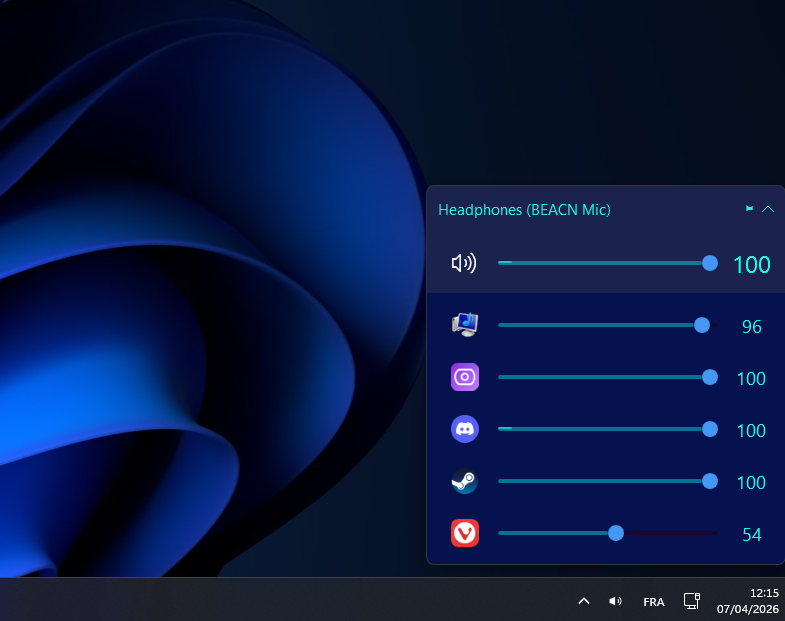
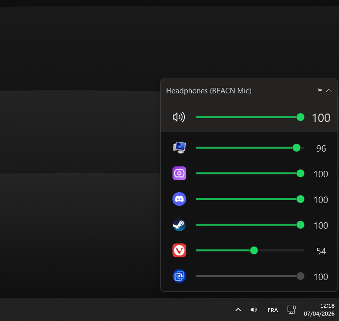
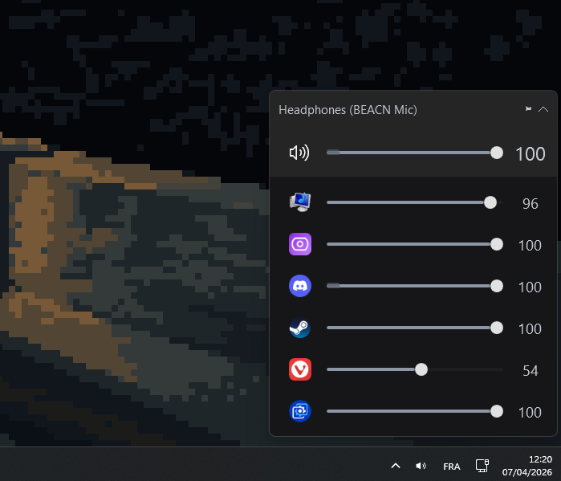

<p align="center">
  <code>♬⋆.˚ ✩°｡⋆⸜ 🎺 ⸝⋆｡°✩ ˚.⋆♬</code>
</p>

<h1 align="center">BetterTrumpet</h1>

<p align="center">
  <a href="https://bettertrumpet.hiii.boo">
    
  </a>
  <a href="https://github.com/xammen/BetterTrumpet/releases">
    
  </a>
  <a href="https://github.com/xammen/BetterTrumpet">
    
  </a>
  <a href="https://www.producthunt.com/posts/bettertrumpet">
    
  </a>
</p>

<p align="center">
  <i>Windows volume control that actually feels good to use.</i><br/>
  <i>A polished fork of EarTrumpet with better onboarding, themes, media controls, profiles, auto-updates, and a CLI that speaks JSON.</i>
</p>

<p align="center">
  <a href="#install">Install</a> ·
  <a href="#highlights">Highlights</a> ·
  <a href="#cli">CLI</a> ·
  <a href="#build-from-source">Build</a> ·
  <a href="#license">License</a>
</p>

---

## What it is

BetterTrumpet keeps the part that mattered from EarTrumpet: fast per-app audio control.
Then it adds the polish and automation that Windows should have had in the first place.

```text
system tray -> BetterTrumpet -> per-app volume
                           ├── themes
                           ├── media popup
                           ├── profiles
                           ├── undo / redo
                           └── CLI / updates
```

## Install

| Method | Best for |
| --- | --- |
| GitHub Releases | The quickest install or the portable zip |
| Winget | People who prefer the Windows package manager |
| Chocolatey | Existing Chocolatey users |
| Build from source | Contributors and local testing |

### Release
Download the latest installer or portable build from GitHub Releases.

### Winget
```powershell
winget install --id xmn.BetterTrumpet
```

### Chocolatey
```powershell
choco install bettertrumpet
```

### Source
Build the app as x86 Release.

```powershell
git clone https://github.com/xammen/BetterTrumpet
nuget.exe restore EarTrumpet.vs15.sln
& "C:\Program Files\Microsoft Visual Studio\2022\Community\MSBuild\Current\Bin\MSBuild.exe" EarTrumpet\EarTrumpet.csproj /p:Configuration=Release /p:Platform=x86 /p:OutputPath=..\Build\Release /t:Rebuild /v:minimal
```

## First Run

1. Launch BetterTrumpet.
2. Click the tray icon to open the volume flyout.
3. Hover the tray icon for the media popup.
4. Right-click for settings and device switching.
5. Use `Ctrl+P` to pin the flyout.
6. Use `Ctrl+Z` / `Ctrl+Y` to undo and redo volume changes.

## Highlights

| Area | What you get |
| --- | --- |
| Onboarding | 6-page setup flow for audio, appearance, privacy, ready, and tray pinning |
| Themes | 7 color channels, presets, custom themes, and dynamic album-art mode |
| Media popup | Hover player with cover art, seek, shuffle, repeat, and blur |
| Profiles | Save, restore, export, import, rename, and apply full audio setups |
| Control | Undo/redo for volume changes, plus a pin mode for the flyout |
| Automation | Pipe-based CLI with JSON output for scripts and hotkeys |
| Reliability | Auto-update prompts, crash reporting, and background health monitoring |
| Performance | Eco mode trims animations and peak meter FPS when you want it lighter |
| Tray icon | Animated state that reflects audio activity |

## Themes

Three looks, same controls, same workflow.

<div align="center">
  <table>
    <tr>
      <td align="center">
        
        <br />
        <sub>Windows</sub>
        <br />
        <sub>Clean, calm, and close to the system look.</sub>
      </td>
      <td align="center">
        
        <br />
        <sub>Spotify</sub>
        <br />
        <sub>Brighter accents with a music-first feel.</sub>
      </td>
      <td align="center">
        
        <br />
        <sub>Pixel</sub>
        <br />
        <sub>Low-key, chunky, and a bit retro.</sub>
      </td>
    </tr>
  </table>
</div>

Pick the look that fits your setup, or switch when the mood changes.

## CLI

BetterTrumpet exposes a pipe-based CLI. Commands return JSON, and the app must be running for remote commands to work.

```powershell
BetterTrumpet.exe --list-devices
BetterTrumpet.exe --set-volume 75
BetterTrumpet.exe --set-volume +10 --app spotify
BetterTrumpet.exe --mute --device "Speakers"
BetterTrumpet.exe --set-default "Headphones"
BetterTrumpet.exe --set-device spotify.exe "Headphones"
BetterTrumpet.exe --apply-profile "Night Mode"
```

| Area | Commands |
| --- | --- |
| Devices | `--list-devices`, `--list-apps`, `--get-volume`, `--set-volume`, `--mute`, `--unmute`, `--toggle-mute` |
| Routing | `--get-default`, `--set-default`, `--set-device` |
| Profiles | `--list-profiles`, `--apply-profile` |
| Automation | `--watch`, `--ping`, `--check-update`, `--export-settings`, `--import-settings` |
| Help | `--version`, `--help` |

## Settings

| Page | What it controls |
| --- | --- |
| Shortcuts | Flyout, mixer, settings, volume up/down, device switch |
| Mouse | Tray icon scroll behavior |
| Community | Telemetry and logarithmic volume |
| Legacy | Legacy icon and compatibility options |
| About | Version, diagnostics, export/import settings |
| Animations | Motion speed, peak meter FPS, eco mode |
| Colors | Theme engine, presets, custom themes |
| Media popup | Hover delay, blur radius, show only while playing |
| Volume profiles | Save, restore, rename, delete, export/import |

### Hotkeys

| Shortcut | Action |
| --- | --- |
| `Ctrl+Z` | Undo last volume change |
| `Ctrl+Y` | Redo last volume change |
| `Ctrl+P` | Pin / unpin the flyout |
| configurable | Open flyout, mixer, settings, or switch device |

## Onboarding

The onboarding wizard has 6 pages:

- Welcome
- Audio
- Appearance
- Privacy
- Ready
- Tray pin

It also covers telemetry, update channels, and startup preferences during setup.

## Build From Source

```powershell
nuget.exe restore EarTrumpet.vs15.sln
& "C:\Program Files\Microsoft Visual Studio\2022\Community\MSBuild\Current\Bin\MSBuild.exe" EarTrumpet\EarTrumpet.csproj /p:Configuration=Release /p:Platform=x86 /p:OutputPath=..\Build\Release /t:Rebuild /v:minimal
powershell -ExecutionPolicy Bypass -File build-portable.ps1
& 'C:\Users\xammen\AppData\Local\Programs\Inno Setup 6\ISCC.exe' installer.iss
```

## Supported Systems

| OS | Status |
| --- | --- |
| Windows 10 (1803+) | Supported |
| Windows 11 | Supported |

## Tech Stack

| Area | Stack |
| --- | --- |
| Language | C# / WPF |
| Framework | .NET Framework 4.6.2 |
| Audio | Windows Core Audio |
| Media | Windows Media Session |
| Packaging | MSBuild + GitVersion + Inno Setup + portable zip |
| CLI | Named pipe IPC |
| Crash reporting | Sentry |

## Credits

Based on [EarTrumpet](https://github.com/File-New-Project/EarTrumpet) by David Golden, Rafael Rivera, and Dave Amenta.

## License

[MIT License](./LICENSE)

<p align="center">
  <br/>
  <code>♬⋆.˚ ✩°｡⋆⸜ 🎺 ⸝⋆｡°✩ ˚.⋆♬</code>
  <br/>
  <br/>
  <i>made with volume ˚ʚ♡ɞ˚</i>
  <br/>
  <br/>
</p>
