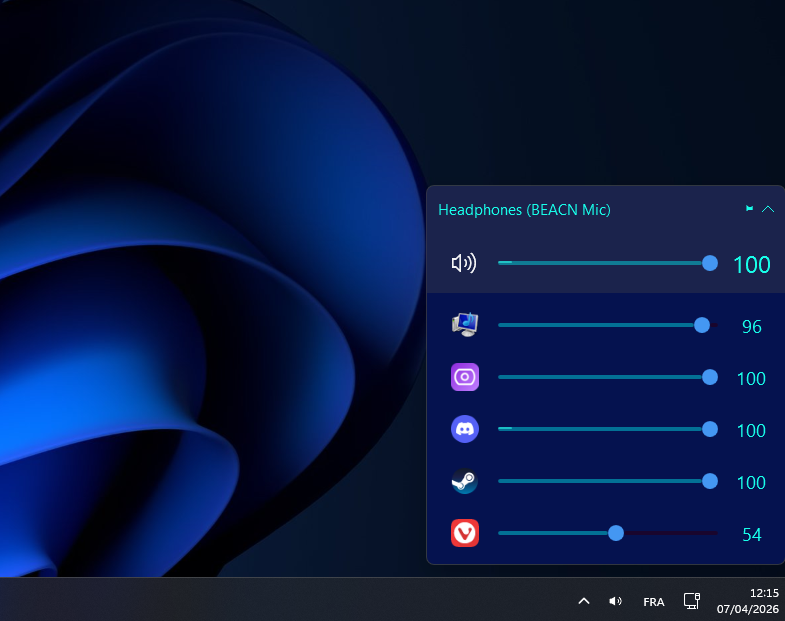
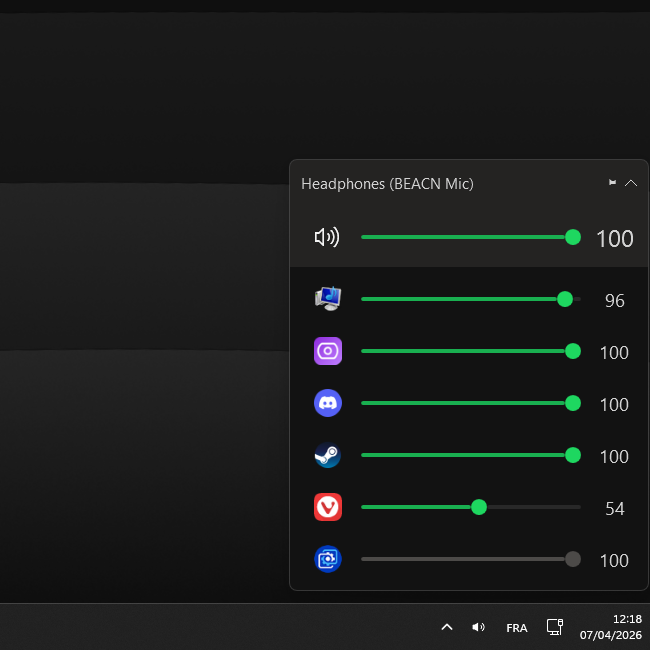
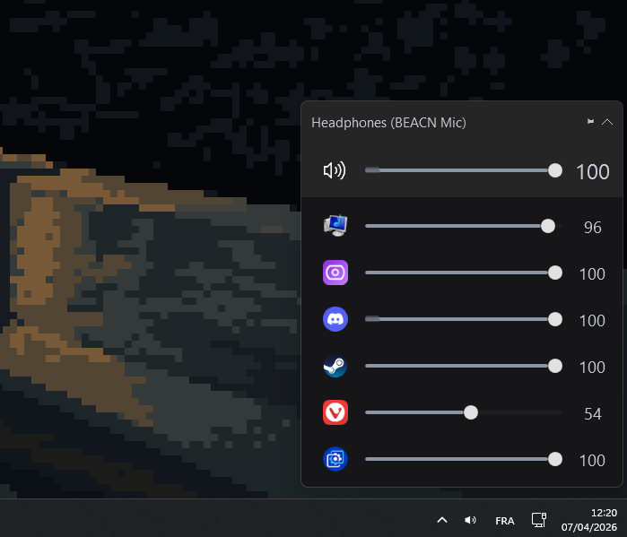

<p align="center">
  <code>♬⋆.˚ ✩°｡⋆⸜ 🎺 ⸝⋆｡°✩ ˚.⋆♬</code>
</p>

<h1 align="center">BetterTrumpet</h1>

<p align="center">
  <a href="https://bettertrumpet.hiii.boo">
    
  </a>
  <a href="https://github.com/xammen/BetterTrumpet/releases">
    
  </a>
  <a href="https://github.com/xammen/BetterTrumpet">
    
  </a>
  <a href="https://www.reddit.com/r/BetterTrumpet/">
    
  </a>
</p>

<p align="center">
  <i>Windows volume control that actually feels good to use.</i><br/>
  <i>A polished fork of EarTrumpet with themes, media controls, profiles, a CLI, and a settings window that does not look like it is from 2012.</i>
</p>

<p align="center">
  <a href="#install">Install</a> ·
  <a href="#highlights">Highlights</a> ·
  <a href="#cli">CLI</a> ·
  <a href="#build-from-source">Build</a> ·
  <a href="#community">Community</a> ·
  <a href="#license">License</a>
</p>

---

## What it is

BetterTrumpet keeps the part that mattered from EarTrumpet: fast per-app audio control.
Then it adds the polish and automation that Windows should have had in the first place.

```text
system tray -> BetterTrumpet -> per-app volume
                           ├── themes
                           ├── media popup
                           ├── profiles
                           ├── settings (React/Fluent UI)
                           ├── undo / redo
                           └── CLI / updates
```

## Install

| Method | Best for |
| --- | --- |
| GitHub Releases | The quickest install or the portable zip |
| Winget | People who prefer the Windows package manager |
| Chocolatey | Existing Chocolatey users |
| Build from source | Contributors and local testing |

### Release
Download the latest installer or portable build from GitHub Releases.

### Winget
```powershell
winget install --id xmn.BetterTrumpet
```

### Chocolatey
```powershell
choco install bettertrumpet
```

### Source
Build the app as x86 Release.

```powershell
git clone https://github.com/xammen/BetterTrumpet
nuget.exe restore EarTrumpet.vs15.sln
& "C:\Program Files\Microsoft Visual Studio\2022\Community\MSBuild\Current\Bin\MSBuild.exe" EarTrumpet\EarTrumpet.csproj /p:Configuration=Release /p:Platform=x86 /p:OutputPath=..\Build\Release /t:Rebuild /v:minimal
```

## First Run

1. Launch BetterTrumpet.
2. Click the tray icon to open the volume flyout.
3. Hover the tray icon for the media popup.
4. Right-click for settings and device switching.
5. Use `Ctrl+P` to pin the flyout.
6. Use `Ctrl+Z` / `Ctrl+Y` to undo and redo volume changes.

## Highlights

| Area | What you get |
| --- | --- |
| Settings | Full React/Fluent UI settings window with Sage Glass design, deep search, and every settings page |
| Focus-lost | Attenuate or mute apps when they lose focus, with configurable fade and per-app scope |
| Themes | 12 curated presets across 5 categories, 7 color channels, per-theme opacity, and dynamic album-art mode |
| Media popup | Hover player with cover art, seek, shuffle, repeat, and per-app volume |
| Profiles | Save, restore, export, import, rename, and apply full audio setups with per-device hotkeys |
| CLI | Pipe-based CLI with JSON output, 20+ commands, and a friendly `bt` shortcut |
| What's-new | In-app feed with polls, surveys, and live votes (beta, disableable) |
| Telemetry | Anonymous ping on startup, no data sold, fully disableable. Manual log export stays on your machine |
| Performance | Eco mode trims animations and peak meter FPS when you want it lighter |
| Reliability | Auto-update prompts, crash reporting, and background health monitoring |

## Themes

Three looks, same controls, same workflow.

<div align="center">
  <table>
    <tr>
      <td align="center">
        
        <br />
        <sub>Windows</sub>
        <br />
        <sub>Clean, calm, and close to the system look.</sub>
      </td>
      <td align="center">
        
        <br />
        <sub>Spotify</sub>
        <br />
        <sub>Brighter accents with a music-first feel.</sub>
      </td>
      <td align="center">
        
        <br />
        <sub>Pixel</sub>
        <br />
        <sub>Low-key, chunky, and a bit retro.</sub>
      </td>
    </tr>
  </table>
</div>

Pick the look that fits your setup, or switch when the mood changes.

## CLI

BetterTrumpet exposes a pipe-based CLI. Commands return JSON, and the app must be running for remote commands to work.

```powershell
BetterTrumpet.exe --list-devices
BetterTrumpet.exe --set-volume 75
BetterTrumpet.exe --set-volume +10 --app spotify
BetterTrumpet.exe --mute --device "Speakers"
BetterTrumpet.exe --set-default "Headphones"
BetterTrumpet.exe --set-device spotify.exe "Headphones"
BetterTrumpet.exe --apply-profile "Night Mode"
bt save focus
bt save discord --apps-only
bt focus
bt volume discord 67
bt toggle-mute discord
bt batch --set-volume 67 --app discord --set-volume 30 --app vivaldi
bt doctor
```

| Area | Commands |
| --- | --- |
| Devices & apps | `--list-devices`, `--list-apps`, `--get-volume`, `--set-volume`, `volume`, `--mute`, `mute`, `--unmute`, `unmute`, `--toggle-mute`, `toggle-mute` |
| Routing | `--get-default`, `--set-default`, `--set-device` |
| QuickTrumpet | `presets`, `save`, `apply`, `mode`, direct preset aliases like `bt focus`, plus compatible `--list-profiles`, `--apply-profile` |
| Automation | `batch`, `doctor`, `--watch`, `--ping`, `--check-update`, `--export-settings`, `--import-settings` |
| Help | `--version`, `--help` |

## Settings

The settings window is now a modern React/Fluent UI app with a collapsible sidebar, deep search, and the Sage Glass design language.

| Page | What it controls |
| --- | --- |
| Shortcuts | Flyout, mixer, settings, volume up/down, device switch, per-device hotkeys |
| QuickTrumpet | Presets-first profiles with recordable hotkeys, rename, export, import |
| Rules | App volume rules (set at launch, lock), folder defaults |
| Appearance | Theme presets, custom colors, tray icon, dynamic album art |
| Media popup | Hover delay, show while paused |
| Performance | Peak meter FPS, eco mode |
| Updates | Auto-check for updates |
| Privacy | Telemetry toggle, what's-new feed toggle |
| Diagnostics | Log export, version info |

### Hotkeys

| Shortcut | Action |
| --- | --- |
| `Ctrl+Z` | Undo last volume change |
| `Ctrl+Y` | Redo last volume change |
| `Ctrl+P` | Pin / unpin the flyout |
| configurable | Open flyout, mixer, settings, or switch device |

## Onboarding

The onboarding wizard has 5 pages:

- Audio
- Appearance
- Privacy
- Ready
- Tray pin

It also covers telemetry, update channels, and startup preferences during setup. Onboarding no longer auto-shows on first launch — you can open it anytime from the tray menu or by holding `Left Ctrl` at startup.

## Build From Source

```powershell
# Build one of x86 / x64 / arm64. The output folder is chosen by the project file:
# Build\Release, Build\Release-x64, Build\Release-arm64.
dotnet build EarTrumpet\EarTrumpet.csproj --no-incremental -c Release -p:Platform=x86

powershell -ExecutionPolicy Bypass -File build-portable.ps1 -Arch x86
& "$env:LOCALAPPDATA\Programs\Inno Setup 7\ISCC.exe" /DArch=x86 installer.iss
```

Swap `x86` for `x64` or `arm64` in all three commands to build the other architectures.
`release.ps1` does all three in one pass. Build the project, not the solution:
`EarTrumpet.ColorTool` and `EarTrumpet.Package` are x86-only and are excluded from the
x64/arm64 solution configurations.

## Supported Systems

| OS | Status |
| --- | --- |
| Windows 10 (1803+) | Supported |
| Windows 11 | Supported |

## Tech Stack

| Area | Stack |
| --- | --- |
| Language | C# / WPF |
| Framework | .NET 8 for Windows |
| Audio | Windows Core Audio |
| Media | Windows Media Session |
| Settings | React / Fluent UI / WebView2 |
| Packaging | MSBuild + GitVersion + Inno Setup + portable zip |
| CLI | Named pipe IPC |
| Telemetry | Anonymous ping (homemade, no third-party SDK) |

## Community

- [GitHub Issues](https://github.com/xammen/BetterTrumpet/issues) — bug reports and feature requests
- [Reddit](https://www.reddit.com/r/BetterTrumpet/) — discussions, feedback, and general hangout

## Credits

Based on [EarTrumpet](https://github.com/File-New-Project/EarTrumpet) by David Golden, Rafael Rivera, and Dave Amenta.

## License

[MIT License](./LICENSE)

<p align="center">
  <br/>
  <code>♬⋆.˚ ✩°｡⋆⸜ 🎺 ⸝⋆｡°✩ ˚.⋆♬</code>
  <br/>
  <br/>
  <i>made with volume ˚ʚ♡ɞ˚</i>
  <br/>
  <br/>
</p>
